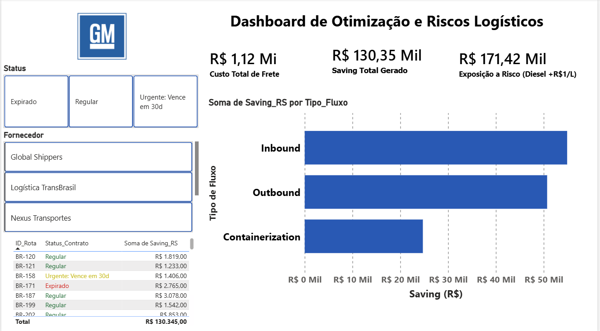

# otimizacao-logistica-gm
Automação de processo de RFQ em Python e Dashboard de Gestão de Riscos Logísticos em Power BI.
# 📊 Dashboard de Otimização e Riscos Logísticos

Este repositório contém o arquivo de desenvolvimento de um painel estratégico interativo criado no Power BI, focado na gestão de indicadores logísticos e financeiros de frete.

⚠️ **NOTA IMPORTANTE:** Todos os dados contidos neste relatório são **100% fictícios**. Eles foram gerados artificialmente e mascarados exclusivamente para fins de demonstração técnica, portfólio e boas práticas de design e desenvolvimento. Qualquer semelhança com dados reais da empresa citada ou de terceiros é mera coincidência.

## 🚀 Funcionalidades e Análises Principais
* **KPIs de Custo:** Exibição macro do Custo Total de Frete, Saving Total Gerado e Exposição a Risco (Diesel + R$1/L).
* **Análise por Fluxo:** Gráfico de barras horizontais detalhando a economia de custos (*Saving*) pelas categorias de fluxo: *Inbound*, *Outbound* e *Containerization*.
* **Filtros Segmentados:** Painel lateral interativo para segmentação rápida por *Status do Contrato* (Expirado, Regular, Urgente) e por *Fornecedor Atual*.

## 🛠️ Tecnologias e Recursos Aplicados
* **Python:** Motor exclusivo de ETL. Utilizado para toda a extração, tratamento, limpeza estrutural e mascaramento completo dos dados brutos de logística.
* **Power BI Desktop:** Importação direta dos dados tratados, modelagem dimensional e construção de toda a interface visual e relatórios.
* **DAX (Data Analysis Expressions):** Criação de medidas calculadas para consolidação dinâmica dos KPIs de custo e risco.
* **Git/GitHub:** Controle de versão do arquivo do projeto.

## 📂 Como Visualizar o Projeto
1. Certifique-se de ter o **Power BI Desktop** instalado em sua máquina.
2. Baixe o arquivo `.pbix` (ou abra a pasta do projeto se estiver usando o formato `.pbip`).
3. Abra o arquivo para interagir com os visuais e explorar o modelo de dados.

## 📸 Visualização do Dashboard

---
Desenvolvido por Guilherme Oliveira Silva 🖥️  
Sinta-se à vontade para entrar em contato via email: guilhermeoliveira2903@gmail.com ou linkedin: linkedin.com/in/guilhermeoliveiraslv/ 
